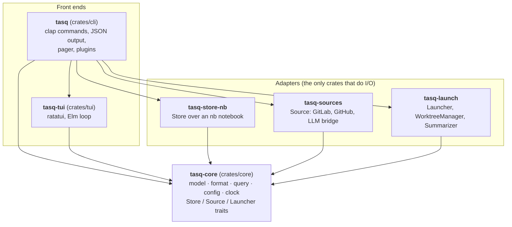
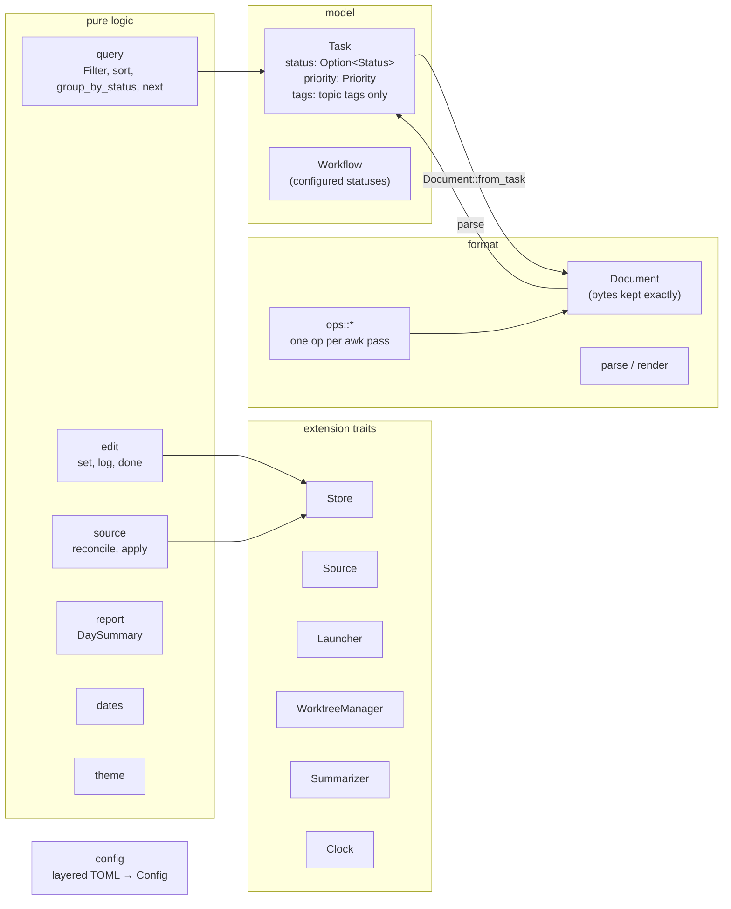
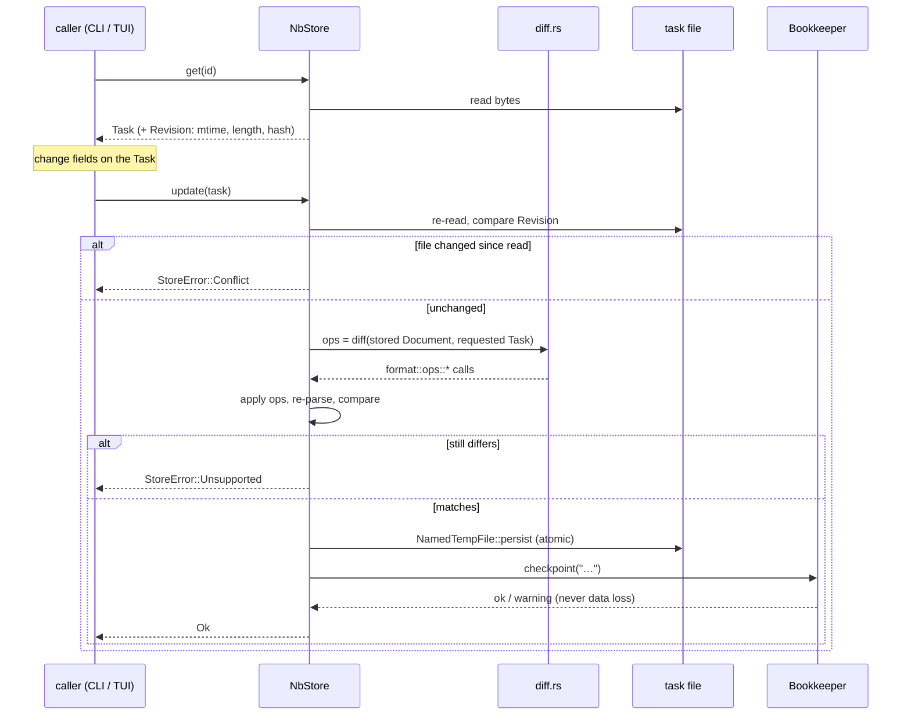
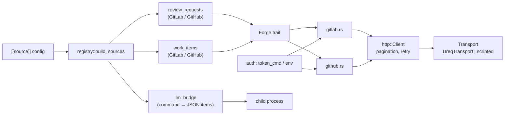
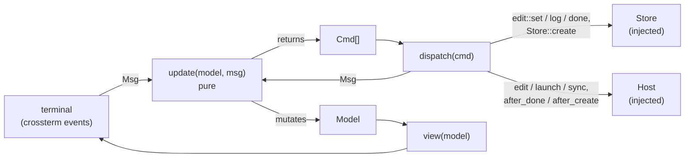
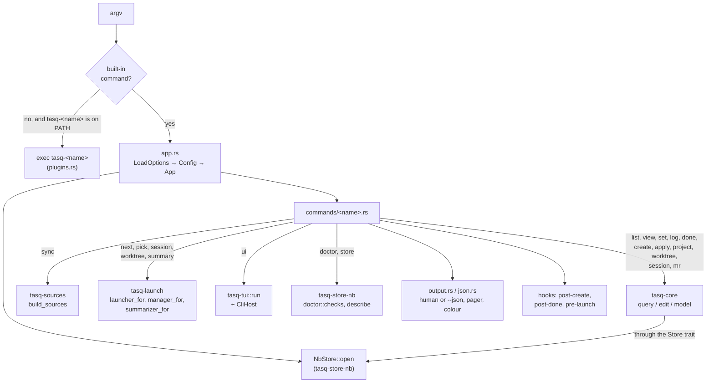
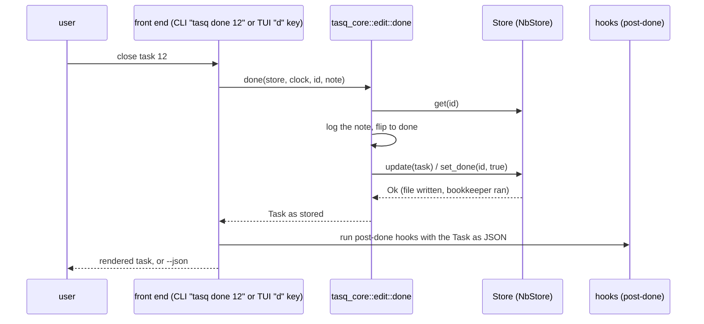

# Architecture

`tasq` is a Cargo workspace of six crates. One crate holds the domain and knows nothing about
the outside world; four crates implement its extension traits against real things (an nb
notebook, GitLab and GitHub, child processes, a terminal); one crate, the `tasq` binary, wires
them together. This document describes each crate, what it owns, and how the crates talk to
each other. The decisions behind the shape are in [`docs/adr/`](adr/README.md).

## The workspace at a glance

Dependencies flow one way, toward `tasq-core`. The adapters never depend on each other, and the
TUI depends on core only; the CLI is the single place where everything meets.

| Crate | Package | Role | Talks to the world through |
|---|---|---|---|
| `crates/core` | `tasq-core` | Domain model, lossless markdown format, queries, config, clock, reconciliation, reports, and the `Store`, `Source`, `Launcher`, `WorktreeManager`, `Summarizer` traits. | Nothing. No filesystem, no processes, no terminal, no network. |
| `crates/store-nb` | `tasq-store-nb` | The `Store` implementation: `*.todo.md` files in an nb notebook, `.index` ids, atomic writes, conflict detection, bookkeeping (`nb` or `git`), `tasq doctor` checks. | Files; `nb` and `git` child processes (only for bookkeeping, never for reads). |
| `crates/sources` | `tasq-sources` | `Source` implementations: GitLab and GitHub review requests and work items over a shared forge client, and the LLM bridge that turns a command's JSON into items. | HTTPS (`ureq`); a child process for the LLM bridge and `token_cmd`. |
| `crates/launch` | `tasq-launch` | `Launcher` implementations (shell, tmux, Claude Code, herdr), `WorktreeManager` implementations (`git`, user command), the command `Summarizer` behind `tasq summary`. | Child processes, with an explicitly injected environment. |
| `crates/tui` | `tasq-tui` | Full-screen terminal UI. Elm architecture over `tasq-core`; everything that needs the outside world goes through a `Host` the CLI provides. | The terminal (ratatui / crossterm). |
| `crates/cli` | `tasq` (lib `tasq_cli`) | The binary. Argument parsing, config loading, opening the store, building sources and launchers, rendering human and `--json` output, hooks and out-of-process plugins. | Everything above, plus stdout, the pager and `PATH` for plugins. |

## tasq-core

The core is the vocabulary every other crate speaks. It has no I/O of its own: time comes from
a `Clock`, configuration loading takes a `LoadOptions` naming the cwd, home and environment,
and the filesystem check in `launch::resolve_workdir` is a closure. That is what keeps the
logic cheap to run thousands of times under `cargo mutants` against temp dirs and fakes.

### Modules

| Module | What it holds |
|---|---|
| `model` | `Task`, `TaskDraft`, `TaskId`, `Status`, `Workflow`, `Priority`, `Tag`, `Link`, `Worktree`, `Session`, `ProgressEntry`, `Origin`. Plain data with validating newtypes. |
| `format` | `Document` (byte-exact file), `parse` and `render`, `ops` (the edit operations), `Document::from_task` for new files. Normative reference: [`docs/file-format.md`](file-format.md). |
| `query` | Pure functions over borrowed tasks: `Filter`, `sort`, `group_by_status`, `next`, `list`. |
| `edit` | The script's `set`, `log` and `done` as operations on a `Store`. Both front ends call these, so they cannot drift. |
| `source` | `Source` trait, `SourceItem`, `reconcile` (items vs tasks, producing `Change`s) and `apply` (writes the changes through a `Store`). |
| `launch` | `Launcher` trait, `LaunchContext`, `resolve_workdir` (first existing worktree, else `## Project`, else `work.default_project`). |
| `work` | `WorktreeManager` trait and the pure worktree/project helpers. |
| `report` | `DaySummary` from progress notes, `Summarizer` trait, `RawSummarizer`. |
| `config` | `Config` and its sub-structs, `LoadOptions`, the six layers, `Loaded::file_for` provenance. Reference: [`docs/config.md`](config.md). |
| `clock` | `Clock`, `SystemClock`, `FixedClock`, `When`, timestamp helpers. Local wall-clock time, no zone, as the script wrote it. |
| `dates` | `today`, `yesterday`, weekday names, ISO dates, report ranges. |
| `theme` | `Color` and `Theme`: colour decisions shared by CLI and TUI; rendering is the front ends' job. |
| `store` | `Store` trait, `StoreError`, `StoreInfo`, `IdScheme`, and `MemoryStore` for tests. |

### Two ideas that shape everything else

**Status and priority are tags in the file, fields in the model.** The `## Tags` line holds
`#gitlab #A #ready`; `Task::status` is `Some(READY)`, `Task::priority` is `A`, and
`Task::tags` is `[gitlab]`. The format layer does the mapping both ways against the configured
`Workflow`. Nothing outside `format` asks "is this tag a status?".

**Edits are operations, not diffs.** `Document` keeps every byte it does not understand. The
original script's insertion rules are not uniform (new sections go before `## Progress`,
`## Project` goes after `## Description`, a new `## Tags` goes at end of file, `### Merge requests`
nests inside `## Related`), so each rule is one function in `format::ops`. The store applies
ops, re-parses, and compares with the requested task; anything it could not express is a
`StoreError::Unsupported`, never a silent drop.

## tasq-store-nb

The only crate that runs `nb` or `git`. Reads never spawn a process: `NbStore::open` resolves
the notebook (`$NB_DIR/<name>`, else `nb notebooks show <name> --path`), reads `.index` (line
number = task id) and parses the files directly.

| Module | What it holds |
|---|---|
| `store` | `NbStore`, `NbStoreOptions` (notebook name, environment for `nb`, bookkeeper choice), `StoreWarning`. |
| `resolve` | Notebook name → directory, as the script's `NB_HOME` block did. |
| `index` | nb's `.index`: one filename per line, id = 1-based line number. Only ever appended to. |
| `revision` | `Revision`: mtime plus content hash, the basis of `Conflict` detection. |
| `diff` | Whole-task write → `format::ops` calls on the stored document. |
| `create` | New `YYYYMMDDHHMMSS.todo.md` file, registered through the bookkeeper, id read back from `.index`. |
| `bookkeeper` | The `Bookkeeper` trait (`register`, `checkpoint`, `verify`, `sync`), `select_bookkeeper`, `NoopBookkeeper` for tests. |
| `nb_cli` | `NbCliBookkeeper`: delegates to `nb index add`, `nb git checkpoint`, `nb index verify`, `nb sync`. Used when `nb` is on `PATH`. |
| `native` | `NativeBookkeeper`: appends to `.index` and runs `git` itself, for people without nb. |
| `nb` | Running `nb` with an injected environment only (`NB_DIR`, `NBRC_PATH`, `HOME`, `PATH`). Tests never touch a real `~/.nb`. |
| `git` | Running `git` inside the notebook with an injected environment, for the native bookkeeper and the diagnostics. |
| `sanitize` | Cleans `nb` output of ANSI escapes and carriage returns, as the script's `sed` did. |
| `doctor` | The store's checks for `tasq doctor`: notebook, index, nb, git identity, bookkeeper. |

Bookkeeping failure after a successful write is a warning carrying the manual fix
(`nb index reconcile`); the file is already on disk. ADR-0007 explains the hybrid.

## tasq-sources

`Source` implementations for `tasq sync`. All HTTP goes through the injected `Transport` trait,
so every client is tested against scripted responses and `cargo test` never touches the
network. `UreqTransport` is the real one.

| Module | What it holds |
|---|---|
| `registry` | `build_source(s)` from `[[source]]` blocks into `Built { name, source, policy, … }`. |
| `forge` | The `Forge` trait: what the two sources need from GitLab or GitHub, plus shared JSON helpers. `MergeRequest`, `WorkItem`, `User`. |
| `gitlab`, `github` | The two `Forge` clients. |
| `review_requests`, `work_items` | The `Source` implementations built on `Forge`. |
| `llm_bridge` | A configured command prints a JSON array of items; parsed and deduplicated. Contract in [`docs/sources.md`](sources.md). |
| `http` | `Client` over `Transport`: JSON decoding, `Link` pagination, backoff on 429 and 5xx. |
| `auth` | Tokens via `token_cmd` (`glab auth token`, `gh auth token`) or `GITLAB_TOKEN` / `GITHUB_TOKEN`. Never printed. |
| `url`, `title` | Parsing MR and issue URLs, and resolving titles for `tasq mr`. |

The reconciliation itself (which items become tasks, which tasks get closed) is not here. It is
`tasq_core::source::reconcile`, pure and mutation-tested; this crate only fetches.

## tasq-launch

Process-running adapters. Every process gets an explicitly injected environment, so tests point
`PATH` at fake executables.

| Module | What it holds |
|---|---|
| `registry` | `launcher_for(name)`, `LAUNCHER_NAMES`, `LaunchSettings`; `resolve_detached` for `launch.detached` (`auto` is herdr inside herdr, tmux inside tmux, else an error). |
| `shell`, `tmux`, `claude`, `herdr` | The four `Launcher`s. `herdr` is behind the default-on `herdr` feature; `launch.herdr.placement` says whether it opens a workspace or a tab. `tmux` and `herdr` honour `LaunchContext::focus` (ADR-0012). |
| `prompt` | The tiny template engine (`{{name}}`, `{{#name}}…{{/name}}`) behind the Claude prompt. Templates are data, in `templates/`. |
| `env` | Environment strategy: run through `direnv exec` so the session gets the target directory's `.envrc`, or inherit. |
| `worktree` | `WorktreeManager`s: `git worktree add`, or a user command (`work.worktree_command`) such as gwm. |
| `summarizer` | `CommandSummarizer`: the configured command (default `claude -p`) that distils a day's notes for `tasq summary`. |
| `process` | Running external programs with an injected environment. |

The pure part of launching, where a session starts (`resolve_workdir`), lives in
`tasq_core::launch`; this crate only runs things.

## tasq-tui

The second consumer of `tasq-core` and the proof of the core/UI boundary (ADR-0005). It depends
on `tasq-core` and ratatui only. The architecture is Elm's.

| Module | What it holds |
|---|---|
| `model` | `Model`, `Mode`, `NoteTarget`: what is on screen and what the keys mean right now. |
| `msg` | `Msg`, `Cmd`, the `Host` trait, `NoHost` and `RecordingHost` for tests. |
| `update` | The pure state transition. |
| `view` | Drawing the model with ratatui widgets, colours from `tasq_core::theme`. |
| `keys` | Key bindings. |
| `runtime` | `dispatch` (runs one `Cmd` against store, clock and host; touches no terminal) and `run` (owns raw mode and the alternate screen). |

Every edit the UI makes is one of the `tasq_core::edit` functions the CLI uses, and `c` creates
a task from a title through `Store::create` with the configured default status and the
directory `tasq ui` runs in as its project (both handed over by the CLI). The three actions
that need the outside world (open an editor, start a work session, run a sync) are `Host`
methods; the CLI implements them by running itself (`tasq pick <id>`, `tasq sync`) while the
UI has released the terminal (ADR-0009). A work session in a new window (`Ctrl+Enter`,
`Shift+Enter`) is `Host::launch` with a `LaunchTarget::Detached`; the CLI runs
`tasq pick <id> --detached [--no-focus]` with its output captured, so the UI keeps the screen
and shows the result in the status bar (ADR-0012). The `d` and `c` keys also reach the
`post-done` and `post-create` hooks through `Host::after_done` and `Host::after_create`
(ADR-0010, ADR-0011).

## tasq (the CLI)

The binary and the composition root. It is deliberately thin: every command is a core function
or a `Store` call followed by rendering, and every command accepts `--json`. The library
(`tasq_cli`) holds all commands so unit tests can exercise them; `main.rs` is one line.

| Module | What it holds |
|---|---|
| `cli` | The clap definitions. |
| `app` | Wiring: process state → `LoadOptions`, config → `App`, `App` → open store, `TASQ_NOW` fixed clock. |
| `commands/*` | One module per command; each `run` is a core or store call plus rendering in human and `--json` form. |
| `output` | Colour decision (`NO_COLOR`, `--color`), ANSI styling, pager (`ui.pager`, default `less -RFX`), JSON emission. |
| `json` | The `--json` envelope: `{"schema": 1, …}`. Tasks serialise exactly as `tasq_core::model::Task`, which `tasq apply` reads back. Reference: [`docs/json.md`](json.md). |
| `error` | CLI error type and exit codes: `0` ok, `1` user error, `2` usage or internal error. |
| `plugins` | Out-of-process plugins: dispatch to `tasq-<name>`, the three hooks, `tasq plugins list`. Reference: [`docs/plugins.md`](plugins.md). |

The CLI is the only crate that knows all the others exist. It builds the concrete `NbStore`,
`Box<dyn Source>`s, `Box<dyn Launcher>`s and the TUI's `Host`, and hands them to code that only
sees the traits.

## Outside the crates

| Path | What it is |
|---|---|
| `plugins/claude/` | The Claude Code plugin: `/tasq:wrapup` and `/tasq:sync` skills plus a status line script. Everything goes through the `tasq` CLI with `--json`. The repository doubles as a one-plugin marketplace. |
| `examples/` | Example configs, a reference plugin (`tasq-tlogs`), a hook, and an LLM-bridge source setup. |
| `homebrew/` | The Homebrew formula template used by the release workflow. |
| `scripts/guard`, `scripts/test-runner` | Memory-capped wrappers every cargo invocation goes through (see `CONTRIBUTING.md`). |
| `original/tasks` | The bash script this project rewrites. Never modified. |
| `ruli/features/rust-rewrite/` | `PLAN.md` (tasks, acceptance criteria, decisions) and `PROGRESS.md` (status, learnings, nb facts). |
| `docs/adr/` | Architecture decision records. |

## How a change moves through the system

The same edit, from either front end:

The front end never touches a file or a tag; it calls one core function and renders the result.

## Testing shape

The dependency direction is what makes the test strategy work:

| Crate | How it is tested |
|---|---|
| `tasq-core` | Unit and integration tests, property tests (`proptest`) for format round trips, byte-identical fixtures in `tests/fixtures/*.md`. Mutation-tested with zero missed mutants as the acceptance bar. |
| `tasq-store-nb` | Tests against a temp copy of the fixture notebook (`tests/support/mod.rs` builds an `NbEnv`). Tests that need the real `nb` skip when it is absent, or fail with `TASQ_REQUIRE_NB=1`. Mutation-tested. |
| `tasq-sources` | Unit tests with a scripted `Transport`; no network in `cargo test`. |
| `tasq-launch` | Fake executables on an injected `PATH`; `insta` snapshots of the commands that would run. |
| `tasq-tui` | `dispatch` against `MemoryStore` and `RecordingHost`; `insta` snapshots of rendered frames. |
| `tasq` (CLI) | Integration tests run the binary against the fixture notebook and snapshot its output with `insta`. Not mutation-tested; the logic lives in core. |

Conventions, the fixture notebook and the mutation-testing workflow: [`docs/testing.md`](testing.md).
